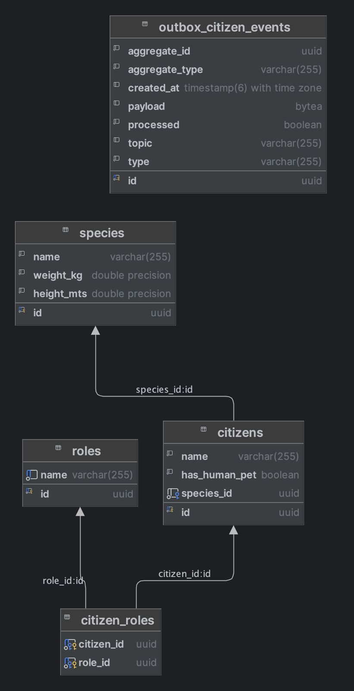

# Documentación de la Base de Datos: Citizen Command Service

Este documento describe el esquema, índices y datos iniciales de una base de datos PostgreSQL diseñada para gestionar especies, ciudadanos, roles y eventos asociados.

---

## 📊 Esquema Relacional



---

## 🧱 Estructura de Tablas

### `outbox_citizen_events`
Almacena eventos de tipo outbox relacionados con entidades ciudadanas.

- `id`: UUID (clave primaria)
- `aggregate_id`: UUID
- `aggregate_type`: VARCHAR(255)
- `created_at`: timestamp con zona horaria
- `payload`: BYTEA
- `processed`: BOOLEAN
- `topic`: VARCHAR(255)
- `type`: VARCHAR(255)

### `species`
- `id`: UUID (clave primaria)
- `name`: VARCHAR(255)
- `weight_kg`: DOUBLE PRECISION
- `height_mts`: DOUBLE PRECISION

### `citizens`
- `id`: UUID (clave primaria)
- `name`: VARCHAR(255)
- `has_human_pet`: BOOLEAN
- `species_id`: UUID (foránea a `species.id`)

### `roles`
- `id`: UUID (clave primaria)
- `name`: VARCHAR(255)

### `citizen_roles`
Tabla de relación N:M entre `citizens` y `roles`.

- `citizen_id`: UUID (foránea a `citizens.id`)
- `role_id`: UUID (foránea a `roles.id`)

---

## 🔍 Índices

```sql
CREATE INDEX IF NOT EXISTS idx_roles_name ON roles(name);
CREATE INDEX IF NOT EXISTS idx_citizen_roles_role_id ON citizen_roles(role_id);
CREATE INDEX IF NOT EXISTS idx_citizen_roles_citizen_id ON citizen_roles(citizen_id);
CREATE INDEX IF NOT EXISTS idx_outbox_processed_created_aggregate
    ON outbox_citizen_events (processed, created_at, aggregate_id);
```

---

## 🧪 Datos Iniciales

### Roles
```sql
INSERT INTO roles (id, name) VALUES
 ('...000001', 'FIRST_MINISTER'),
 ('...000002', 'TREASURER'),
 ('...000003', 'GENERAL'),
 ('...000004', 'SECRETARY_OF_STATE'),
 ('...000005', 'MINISTER_OF_STATE'),
 ('...000006', 'CIVIL')
ON CONFLICT (id) DO NOTHING;
```

### Especies
```sql
INSERT INTO species (id, name, weight_kg, height_mts) VALUES
 ('...000001', 'Felis Domestica', 4.5, 0.25),
 ('...000002', 'Canis Familiaris', 18.0, 0.45),
 ('...000003', 'Rattus Norvegicus', 0.3, 0.10),
 ('...000004', 'Equus Ferus', 500.0, 1.7),
 ('...000005', 'Gallus Gallus Domesticus', 2.5, 0.4)
ON CONFLICT (id) DO NOTHING;
```

---
